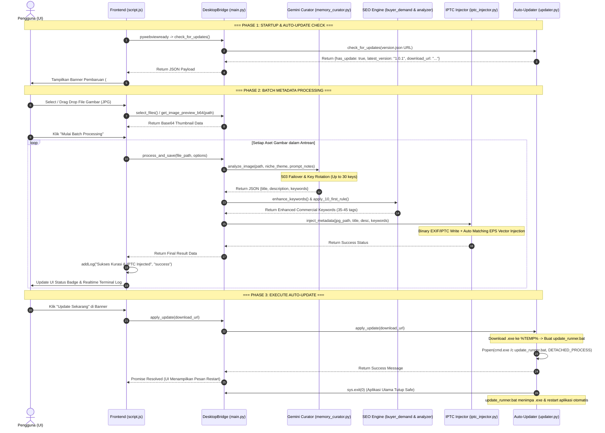

# 🤖 AGENTS.md — Master Architecture, Directory Map & Data Flow

> **Dokumen Panduan Utama AI Agent & Pengembang**  
> File ini dirancang khusus sebagai *single source of truth* (peta utama) agar AI Coding Agent (Gemini, Claude, GPT, Antigravity) dan pengembang dapat langsung memahami seluruh arsitektur folder, fungsi-fungsi utama, serta alur data aplikasi **StockMeta Studio**.

---

## 📌 1. Ringkasan Proyek

- **Nama Aplikasi**: StockMeta Studio (v1.0.0)
- **Pengembang**: BRKH STUDIO
- **Teknologi Utama**: Python 3.10+, PyWebView (Edge WebView2), Vanilla JS (ES6), Tailwind CSS, FontAwesome 6, Pillow, IPTCInfo3, httpx.
- **Tujuan Utama**: Otomatisasi analisis visual aset microstock (JPG/EPS) berbasis Google Gemini Vision AI, penulisan metadata biner langsung ke header EXIF/IPTC fisik tanpa file locking, dan sistem In-App Auto-Update mandiri.

---

## 📁 2. Indeks Struktur Direktori & Peran Modul

```text
StockMetaStudio/
├── core/                                # CORE BACKEND MODULES (PYTHON)
│   ├── __init__.py                      # Inisialisasi paket core
│   ├── path_utils.py                    # Normalisasi Path & Windows Long Path (\\?\) Handling
│   ├── updater.py                       # Sistem Auto-Update Mandiri (httpx + SemVer + Batch Runner)
│   ├── memory_curator.py                # Gemini Vision AI Curator (Multi-Key Rotation & 503 Failover)
│   ├── iptc_injector.py                 # Direct Binary EXIF, IPTC & EPS Vector XMP Metadata Injector
│   ├── buyer_demand.py                  # Realtime Buyer Suggestion Search Engine (Google, Bing, DDG)
│   ├── keyword_analyzer.py              # Commercial Scorer (0-100) & Adobe Stock 10-First Sorter
│   ├── keyword_cluster.py               # Semantic Tier Clustering & Series Batch Deduplicator
│   └── keyword_serp.py                  # Lightweight SERP Signal Research (PAA & Trends)
│
├── public/                              # ASET STABIL & IKON
│   ├── icon.ico                         # Ikon aplikasi executable Windows
│   ├── icon.jpg                         # Logo header aplikasi (JPG)
│   └── icon.png                         # Logo PNG transparan
│
├── doc/                                 # DOKUMENTASI LENGKAP
│   ├── agents.md                        # [DOCUMENT INI] Peta Arsitektur Utama untuk AI Agent
│   ├── architecture.md                  # Dokumentasi Arsitektur Perangkat Lunak
│   ├── documentation.md                 # Panduan Pengguna & Dokumentasi Teknis
│   ├── readme.md                        # Ringkasan Proyek & Panduan Memulai
│   └── LICENSE                          # Lisensi MIT Resmi BRKH STUDIO
│
├── dist/                                # OUTPUT KOMPILASI EXE
│   └── StockMetaStudio.exe              # Executable Portabel Windows Standalone (~113 MB)
│
├── GITHUB_RELEASE.md                    # Draf Form & Catatan Rilis Resmi GitHub v1.0.0
├── version.json                         # Manifest Versi Publik (Auto-Update Manifest)
├── index.html                           # Antarmuka Dashboard (Tailwind, Modals, Update Banner)
├── style.css                            # Custom Styles (Scrollbar, Pulse Animation, API Key Masking)
├── script.js                            # Low-RAM Vanilla JS Frontend & Realtime Terminal Logger
├── main.py                              # Entry Point Host & Class DesktopBridge (IPC PyWebView)
└── build_exe.py                         # Script Kompilasi PyInstaller Standalone
```

---

## ⚙️ 3. Tabel Kelas & Fungsi Utama (Core Functions Reference)

### A. Python Backend Layer (`main.py` & `core/`)

| File / Modul | Kelas / Fungsi Utama | Peran & Deskripsi |
| :--- | :--- | :--- |
| **`main.py`** | `DesktopBridge` | Kelas bridge utama yang diekspos ke JS API PyWebView via `window.pywebview.api`. |
| `main.py` | `select_files()` | Membuka native file dialog Windows untuk memilih file gambar (JPG). |
| `main.py` | `get_image_preview_b64()` | Mengenerate thumbnail Base64 (max 280px) hemat RAM untuk bypass CORS `file://`. |
| `main.py` | `process_and_save()` | Orkestrator utama: Memanggil AI Curator -> Buyer Demand -> Scoring -> IPTC/EPS Injection. |
| `main.py` | `save_api_keys()`, `get_api_keys()` | Manajemen simpan/muat hingga 30 API Key Gemini ke `~/.stockmeta_config.json`. |
| `main.py` | `check_for_updates()`, `apply_update()` | Ekspos fitur auto-update dari `core/updater.py` ke frontend JS. |
| **`core/updater.py`** | `check_for_updates()` | Mengambil `version.json` via `httpx` (timeout 5s) & membandingkan versi SemVer. |
| `core/updater.py` | `apply_update()` | Mengunduh paket update `.exe` ke `%TEMP%` & mengeksekusi detached batch launcher (`update_runner.bat`) untuk menimpa file tanpa terkunci. |
| **`core/memory_curator.py`** | `SafeMemoryCurator` | Engine analisis visual Gemini. Mengelola Niche Theme prompt guidance, failover 503 otomatis (`gemini-2.5-flash`, `gemini-1.5-flash`, dst.), dan rotasi key round-robin. |
| **`core/iptc_injector.py`** | `IPTCInjector` | Menulis EXIF Details (`XPTitle`, `XPKeywords`) via Pillow BytesIO, header IPTC biner via `iptcinfo3`, dan XMP packet ke file `.eps` pasangan di folder yang sama. |
| **`core/buyer_demand.py`** | `BuyerDemandFetcher` | Meriset kueri pencarian komersial nyata dari Google/Bing & menyaring tag kata tunggal bernilai jual tinggi. |
| **`core/keyword_analyzer.py`** | `KeywordAnalyzer` | Menilai Skor Komersial (0-100), mendemosi kata pasif visual (`isolated`, `white`), dan menaruh 10 kata kunci utama di urutan awal. |
| **`core/keyword_cluster.py`** | `KeywordClusterer` | Pengelompokan hierarki kata kunci & pencegahan kata kunci duplikat pada aset serial. |
| **`core/path_utils.py`** | `normalize_path()` | Menangani normalisasi slash path Windows & prefix `\\?\` untuk Windows Long Path. |

---

### B. JavaScript Frontend Layer (`script.js` & `index.html`)

| Komponen / Fungsi | Lokasi | Peran & Deskripsi |
| :--- | :--- | :--- |
| `state` | `script.js` | Object state global frontend (daftar aset, status processing, limit concurrency, preset). |
| `checkForUpdates()` | `script.js` | Memanggil bridge `check_for_updates()`, menampilkan banner notifikasi jika ada versi baru. |
| `initAutoUpdateUI()` | `script.js` | Menghubungkan event listener tombol "Update Sekarang", "Nanti Saja", dan "Periksa Pembaruan". |
| `applyApiKeySensorState()` | `script.js` | Mengatur mode masking sensor bintang (`-webkit-text-security: disc`) dan toggle ikon mata pada API Key. |
| `addLog()`, `renderLogs()` | `script.js` | Terminal log live dengan pemangkasan memori otomatis (maksimal 300 item) dan badge error merah. |
| `updateKeyRotationUI()` | `script.js` | Merender chip preview API Key aktif beserta indikator status kuota/sensor. |
| `#updateBanner` | `index.html` | Banner notifikasi pembaruan di dashboard utama (default tersembunyi). |
| `#btnToggleApiKeySensor` | `index.html` | Tombol toggle ikon mata untuk menampilkan/menyembunyikan teks API Key. |
| `#consoleLogModal` | `index.html` | Drawer/Modal terminal log real-time dengan filter status. |

---

## 🔄 4. Alur Data Lengkap (End-to-End Data Flow Pipeline)



---

## 🔒 5. Kontrak Keamanan & Aturan Pengembangan (Agent Rules)

Jika Anda adalah AI Agent yang memodifikasi codebase ini, Anda **WAJIB** mematuhi aturan berikut:

1. **Prinsip Bebas winerror 32 (File Locking)**:
   - Jangan pernah membuka handler file biner secara terus-menerus. Penulisan EXIF/IPTC harus selalu menggunakan buffer ephemeral `BytesIO` atau library `iptcinfo3` yang ditutup penuh setelah penulisan.
2. **Batas Memori RAM (< 130 MB)**:
   - Preview thumbnail di web browser **WAJIB** berupa string Base64 resolusi rendah (max 280px) yang dihasilkan melalui Python Pillow, diikuti oleh pemanggilan explicit `gc.collect()`.
3. **Penanganan Error Server 503 & Rotasi Key**:
   - Jika mengubah `memory_curator.py`, pastikan fallback model (`gemini-2.5-flash` -> `gemini-3.5-flash-lite` -> `gemini-3.5-flash` -> dst.) dan rotasi key round-robin tetap terjaga. Jangan biarkan exception 429 atau 503 membuat batch mati pertengahan jalan.
4. **Respon IPC PyWebView Berbentuk Dict**:
   - Semua bridge method di `DesktopBridge` (`main.py`) harus mengembalikan `dict` bertipe `{"status": "success"|"error", "data": ..., "message": ...}`.
5. **Sensor Teks API Key**:
   - Jangan menghapus kelas `.masked-api-key` atau logika `isApiKeyVisible` pada `script.js` demi menjaga privasi kunci API pengguna.
6. **Alur Perubahan Versi (Version Bump Workflow v1.0.x)**:
   - Folder Google Drive Utama: `https://drive.google.com/drive/folders/14724m0TmLfqovKGj26beYAigJTfuE6Zo?usp=drive_link`
   - Setiap rilis baru menaikkan angka versi paling belakang (`v1.0.0` -> `v1.0.1` -> `v1.0.2` -> `v1.0.3`, dst.).
   - Saat rilis versi baru:
     1. Ubah `CURRENT_VERSION` di `core/updater.py`.
     2. Jalankan `python build_exe.py` untuk menghasilkan file `dist/StockMetaStudio.exe`.
     3. Upload `StockMetaStudio.exe` baru ke folder versi bersangkutan di Google Drive (misal `stock meta studio/v1.0.1/`).
     4. Perbarui `download_url` dan `version` di `version.json` agar terbaca oleh seluruh klien aplikasi aktif.

---

> 💡 **Tips AI Agent**: Baca berkas ini terlebih dahulu sebelum membaca file source code spesifik untuk menghemat token konteks dan memahami relasi antar modul secara langsung.

